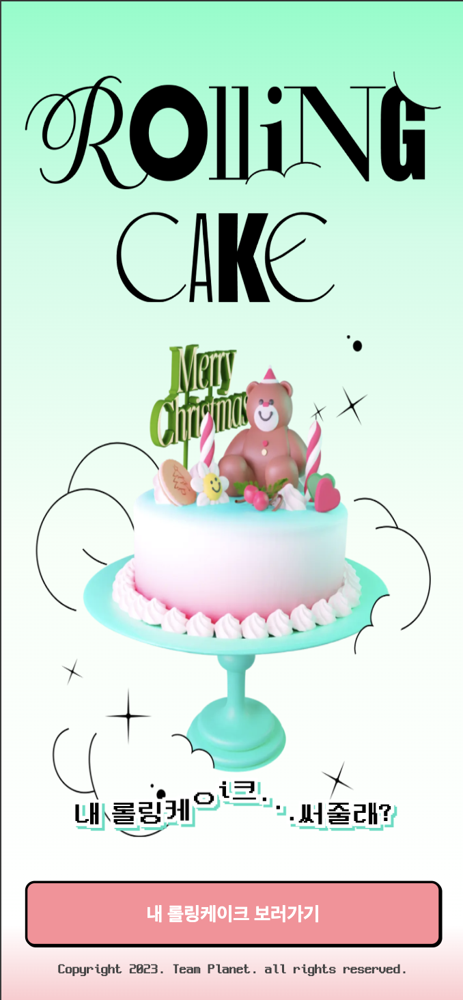
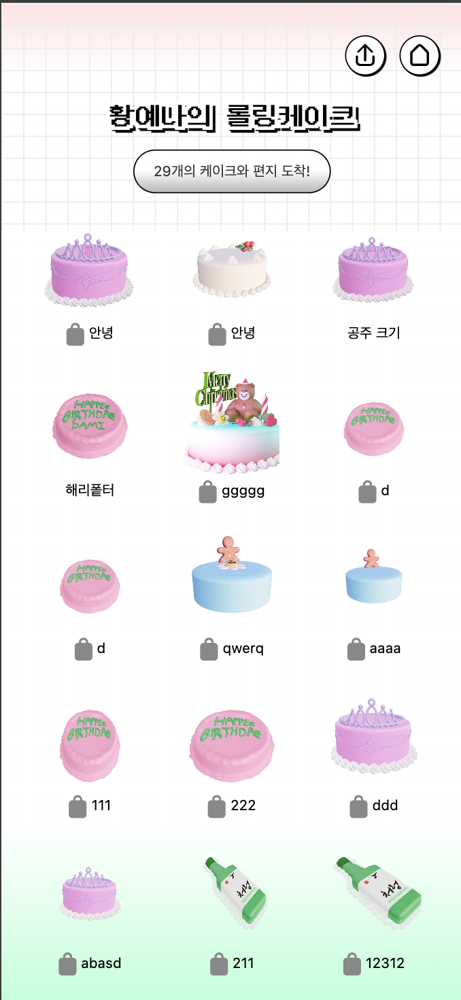
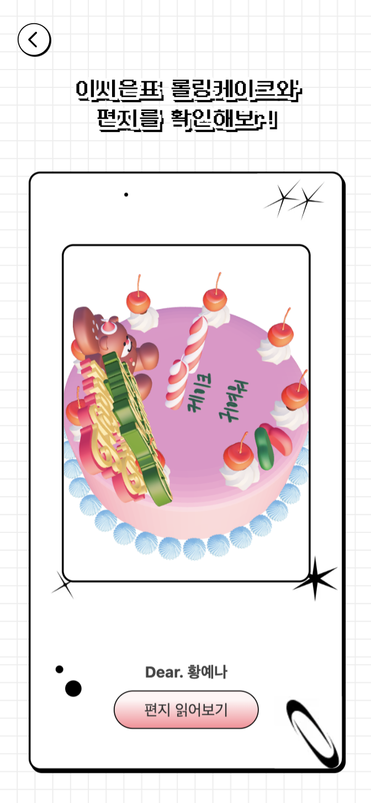
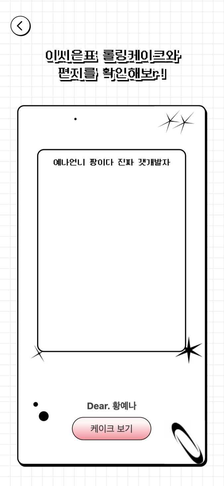
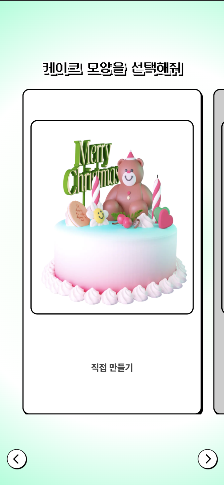
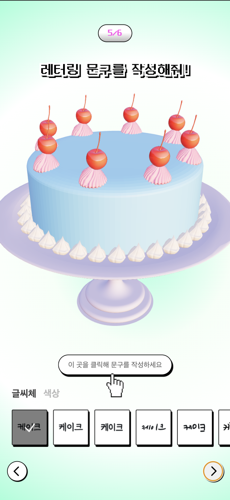

# 롤링케이크 🎂

## 케ㅇi크로 전하는 내 마음…🥹🎂

내 케이크 진열대를 만들고
인스타그램 스토리로
친구에게 링크를 공유해보세요.

링크를 받은 친구가
멋진 케이크랑 편지를 남겨줄 거에요!

연말을 맞이해 소중한 사람들과
롤링페이퍼 편지를 주고받는 건 어떨까요?

### ~~~[http://rolling-cake.com/](http://rolling-cake.com/)~~~
현재는 서비스가 종료되었습니다.

 

## 사용 기술

**Client**

- Next.js 13v
- Jotai, SWR
- postcss, tailwindcss
- react-three-fiber, react-three-drei

 

**Server**

- [Nextjs Route Handlers](https://nextjs.org/docs/app/building-your-application/routing/route-handlers)
- Mongodb
- prisma

 

**Deploy**

- AWS EC2 + Route53 + Docker

 

## 페이지 정보

### 로그인 / 메인 페이지
  
로그인을 해서 나만의 케이크 리스트를 만들어봐요.
 

### 케이크 리스트 페이지
  
내가 받은 케이크를 볼 수 있어요.   
자물쇠 표시가 있는 편지는 나만 볼 수 있어요
 

### 케이크 상세 페이지
  
  
친구가 써 준 편지와, 직접 만들어준 케이크를 볼 수 있어요.    
빙글빙글 돌아가는 예쁜 케이크를 감상해보세요!
 

### 케이크 만들어주기
  
  
친구에게 예쁜 케이크를 만들어 선물해보세요